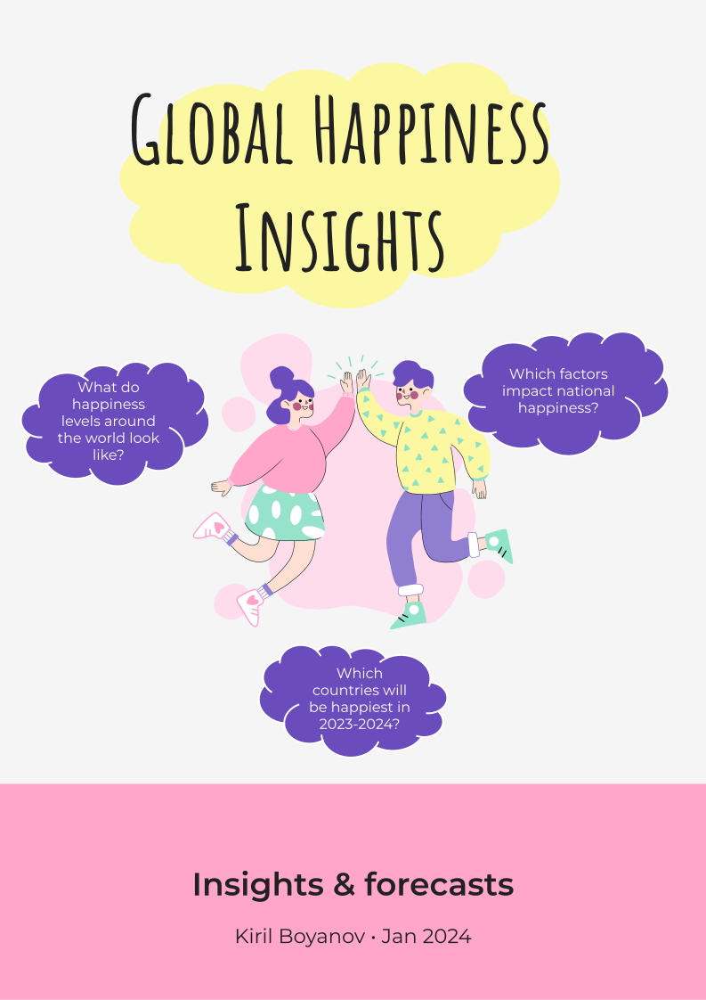
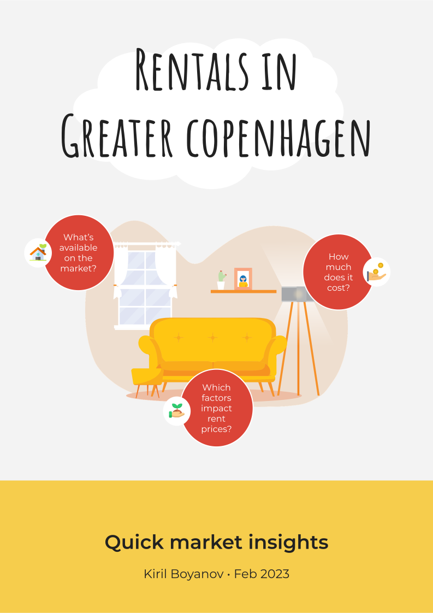

 
 

# Welcome to MindGraph

👋 **Hello, my name's Kiril and welcome to MindGraph**: my private consultancy specialised in helping you leverage your data by transforming it into actionable insights. I am passionate about finding patterns in the data and providing decision-makers with practical, data-driven recommendations.

[Click here](index_dk.md) to read my website in Danish 😊

## Get help with your project

Whether it's scoping projects, creating data ETL pipelines and BI reports, or developing predictive models, my expertise spans a **broad spectrum** of data-related services.

Here are some of the areas I cover:

- Project scoping
- Data collection
- Survey design
- Data cleaning (ETL)
- Data analysis
- Data visualisation
- BI reporting
- ML modelling

## Unlock the potential of your data

Data is almost never perfect, but that doesn't deter me from using it to extract valuable insights. By combining your **domain knowledge** and my **data expertise**, we can test your hypotheses in practice, highlight important conclusions and recommend actions to address pressing challenges.

Please reach out to me at [info@mindgraph.dk](mailto:info@mindgraph.dk) for a free, no-strings-attached 30 minutes meeting where we can discuss your needs and do some initial project scoping.

## Take a peek at what MindGraph could do for you

To see how I've applied my skills in **real-life situations**, feel free to explore some of the projects I've worked on in the past:

### Global happiness insights (2024)

A study of the rentals market in Greater Copenhagen, with a focus on what's available, how much it costs and why as well as a predictive model for monthly rent size

### Rentals in Greater Copenhagen (2023)

A study of how global happiness has evolved throughout time, what factors determine happiness levels and predictions for which the happiest countries will be in 2023 and 2024:

In these projects, I've taken care of the whole process from sourcing and cleaning the data to analysing it and communicating the insights in layman terms. I constantly work on new projects, so feel free to check back the full list later for some more awesome stuff!