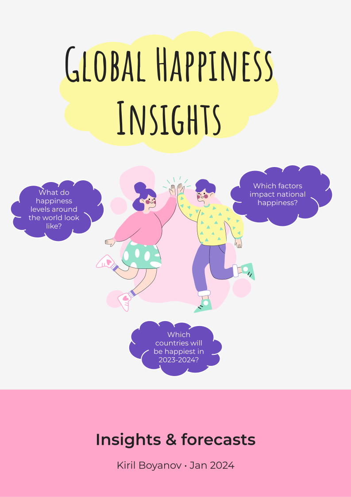
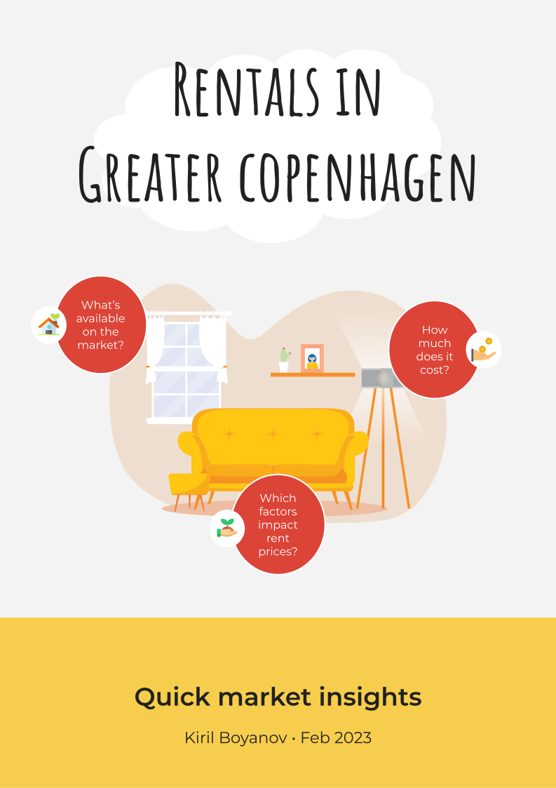

 
 

# Velkommen til MindGraph

👋 **Hej, jeg hedder Kiril, og velkommen til MindGraph**: mit eget konsulentsfirma, specialiseret i at hjælpe dig med at omdanne dine data til  indsigter, som du kan handle på. Jeg brænder for at finde sammenhænge i data samt bistå beslutningstagere med praktiske, databaserede anbefalinger.

[Tryk her](index.md) for at skifte til hjemmesidens engelske udgave 😊

## Få hjælp med dit projekt

Uanset om det drejer sig om at definere og afgrænse projekter, skabe ETL pipelines og BI rapporter eller udvikle prædiktive modeller, mit kendskab spreder sig over **en bred vifte** af datarelaterede opgaver.

Her er nogle af de områder, hvorpå jeg kan bidrage:

- Scoping af data projekter
- Dataindsamling
- Spørgeskemadesign
- Datarensning (ETL)
- Statistisk dataanalyse
- Data visualisering
- BI rapportering
- ML modellering
- Udforsk dine datas potentiale

Data er næsten aldrig perfekt, men det skal ikke forhindre os i at finde værdifulde indsigter i dem. Ved at kombinere **din domæneviden** og **min dataekspertise** kan vi teste dine hypoteser i praksis, fremhæve vigtige konklusioner og lave konkrete anbefalinger, som du kan handle på.

Kontakt mig venligst på [info@mindgraph.dk](mailto:info@mindgraph.dk) for et gratis uforpligtende møde på 30 minutter, hvor vi kan diskutere dine behov og vores mulige samarbejde i forbindelse med dit projekt.

## Tag et kig på hvad MindGraph kan gøre for dig

For at se hvordan jeg har brugt mine evner **i praksis**, tag gerne et kig på nogle af de projekter, jeg har arbejdet på indtil videre:

### Studie af nationalglæde verden rundt (2024)

En undersøgelse af, hvordan global lykke har udviklet sig gennem tiden, hvilke faktorer bestemmer lykkeniveauer og forudsigelser, for hvilke de lykkeligste lande vil være i 2023 og 2024:

### Studie af lejeboliger i Storkøbenhavn (2023)

En undersøgelse af lejemarkedet i Storkøbenhavn med fokus på, hvad der er tilgængeligt, hvor meget det koster og hvorfor samt en forudsigelsesmodel for månedlig lejestørrelse:

I disse projekter har jeg nemlig været med til alt fra start til slut, dvs. at jeg både har indsalmet, renset og analyseret på dataene samt formidlet de endelige indisgter i menneskesprog. Jeg arbejder hele tiden på nye projekter, og du er altid velkommen til at tjekke den fulde liste for at finde flere spændende ting!